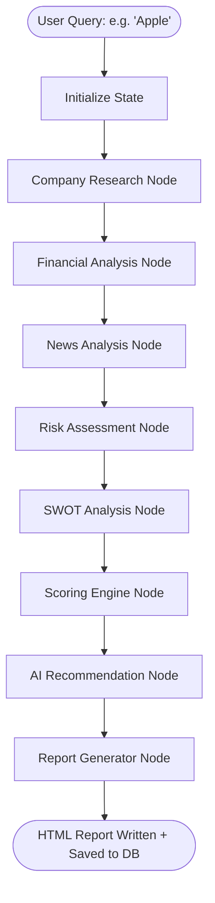
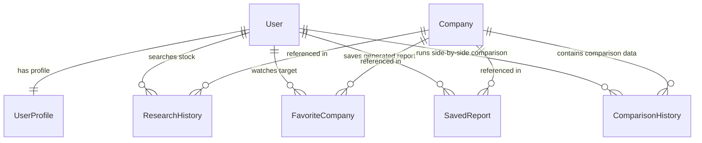

# InvestIQ

InvestIQ is an enterprise-grade, production-ready AI investment research assistant. It coordinates a multi-node cooperative agent pipeline via **LangGraph** to collect, analyze, score, and recommend equities with 100% explainable, mathematically deterministic scoring metrics. 

The frontend features a high-fidelity SaaS interface (Perplexity-style live analysis tracker, section-by-section streaming content, interactive Recharts graphs, and A4 print-ready layout engine) built with React 19, Tailwind CSS, and Framer Motion. The backend runs on Django REST Framework, utilizing yfinance for real-time market data extraction and Gemini 2.5 Flash for quantitative summary and SWOT reasoning.

---

## 🏗️ System Architecture & Workflow

InvestIQ adopts a strict sandboxed agent pattern. Unlike standard AI chatbots that hallucinate ratings directly, the agent pipeline is modularized into distinct operational steps. Each node has a specialized scope, and the outputs are combined deterministically to produce the final recommendation.

### LangGraph Agent Pipeline Flow


1. **Company Research Node**: Resolves the ticker, pulls corporate metadata (CEO, industry, employees), and caches details.
2. **Financial Analysis Node**: Fetches multi-year statements, computes capital ratios (P/E, P/B, ROE, Debt/Equity, margins).
3. **News Analysis Node**: Aggregates corporate headlines and classifies overall sentiment.
4. **Risk Assessment Node**: Audits structural balance sheet risks and macroeconomic headwinds.
5. **SWOT Analysis Node**: Compiles Strengths, Weaknesses, Opportunities, and Threats based on corporate data.
6. **Scoring Engine Node**: Computes deterministic weighted score and confidence waterfall logs.
7. **AI Recommendation Node**: Synthesizes the quantitative metrics into an investment committee thesis.
8. **Report Generator Node**: Saves records to the database and compiles the final print-ready A4 HTML layout.

---

## 📊 Scoring & Recommendation Formula

To guarantee complete explainability, the final **AI Score** is computed using weighted category parameters instead of letting the LLM choose the rating arbitrarily:

$$\text{AI Score} = (\text{Financial Health} \times 0.30) + (\text{Growth} \times 0.25) + (\text{Valuation} \times 0.20) + (\text{Risk Safety} \times 0.15) + (\text{News Sentiment} \times 0.10)$$

Where:
- **Financial Health**: Evaluates liquidity (current ratio) and solvency (debt-to-equity).
- **Growth**: Assesses year-over-year revenue and net income growth rates.
- **Valuation**: Grades trailing multiples (P/E, P/B, P/S) relative to historical baselines.
- **Risk Safety**: Measures structural leverage metrics and stability index.
- **News Sentiment**: Computes headline lexicon tone and Gemini sentiment classification.

### Recommendation Thresholds
- **$\ge$ 90**: Strong BUY 🟢
- **80 – 89**: BUY 🟢
- **60 – 79**: HOLD 🟡
- **< 60**: PASS 🔴

### Confidence Score Calculation
The confidence level represents signal agreement across the 5 categories:

$$\text{Confidence Score} = 50 + \sum_{i=1}^{n} (\text{Category Score}_i - 50) \times \text{Weight}_i \times 0.6$$

This formula rewards convergence (where all metrics agree) and penalizes divergence (where some signals conflict), providing users with an explainable waterfall contribution breakdown.

---

## ⚡ Core Features

- **Perplexity-Style Live Tracker**: Feeds real-time backend state updates (7-step progression pipeline) directly to the user interface.
- **Explainable Metrics Waterfall**: Graphically displays how each financial category contributed to or detracted from the final confidence score.
- **Interactive Financial Visualizer**: Dual-axes Recharts layouts for Revenue vs. Net Income and Operating Cash Flow across yearly or quarterly timelines.
- **Multi-Stock Comparator**: Evaluates multiple tickers side-by-side and invokes a specialized analyst prompt to render comparative reports.
- **Dynamic Watchlist**: Saves target price goals, tracks current stock margins, and updates user notes dynamically.
- **Audit Logs & Historical Reports**: Stores full HTML reports in database records, allowing instantaneous loading and retrospective reviews.
- **A4 Print-Ready Export**: Compiles exact $210\text{mm} \times 297\text{mm}$ styled HTML layouts that convert to PDFs with clean page breaks and zero viewport distortion.

---

## 📂 Project Structure

```
investment-agent/
├── backend/
│   ├── config/                 # Django settings, ASGI/WSGI routing
│   ├── authentication/         # JWT auth, user profiles
│   ├── companies/              # Data services (yfinance parser, Recharts transformers)
│   │   └── services/           # Business logic for charts, news, financials
│   ├── research/               # LangGraph flows, database models, export views
│   ├── chat/                   # Interactive chat assistant nodes and prompts
│   ├── test_services.py        # Core data layer verification script
│   ├── test_api_integration.py # Mocked API endpoint tests
│   └── requirements.txt        # Backend dependencies
└── frontend/
    ├── src/
    │   ├── context/            # Global state (Auth, Theme, Toast)
    │   ├── components/         # Global Layout, Protected Route, navigation
    │   │   └── ui/             # Atomic design components (Cards, Skeletons, Modals)
    │   ├── pages/              # Main dashboard viewports (Watchlist, Comparison, reports)
    │   ├── services/           # Axios HTTP adapters
    │   ├── App.jsx             # React routing entry point
    │   └── index.css           # Global typography and theme configurations
    ├── tailwind.config.js      # CSS styling variables
    └── vite.config.js          # Hot-reloading development server
```

---

## 📋 Database Schema



---

## ⚙️ Installation & Setup

### Prerequisites
- Python 3.10+
- Node.js 18+

### 1. Clone & Configure Environments
Create a `.env` file inside the `backend/` directory based on the `.env.example` in the root:
```env
DEBUG=True
SECRET_KEY=django-insecure-local-development-key-change-this-for-production
GEMINI_API_KEY=your_google_gemini_api_key_here
```

### 2. Backend Setup
1. Navigate to the backend folder:
   ```bash
   cd backend
   ```
2. Create and activate a Python virtual environment:
   ```bash
   python -m venv venv
   # On Windows:
   .\venv\Scripts\activate
   # On macOS/Linux:
   source venv/bin/activate
   ```
3. Install the dependencies:
   ```bash
   pip install -r requirements.txt
   ```
4. Run migrations and seed files:
   ```bash
   python manage.py migrate
   ```
5. Start the Django API server:
   ```bash
   python manage.py runserver
   ```
   The backend will start on `http://127.0.0.1:8000`.

### 3. Frontend Setup
1. Open a new terminal and navigate to the frontend folder:
   ```bash
   cd frontend
   ```
2. Install package dependencies:
   ```bash
   npm install
   ```
3. Run the development server:
   ```bash
   npm run dev
   ```
   The application will run locally at `http://localhost:5173`.

---

## 🧪 Running Tests & Verifications

The repository contains isolated test files to audit both the network services and Django controllers.

### Verify Data Service Layer (yfinance & charts)
```bash
cd backend
.\venv\Scripts\python.exe test_services.py
```

### Verify Endpoint Integration (Mocks LLM calls for offline execution)
```bash
cd backend
.\venv\Scripts\python.exe test_api_integration.py
```

---

## 📈 Example Report & Analysis

Running an analysis for **TSLA (Tesla, Inc.)** executes the following calculations:
- **Financial Health**: Evaluates current liquidity ratios ($1.92\text{x}$) and debt structure ($20\%$), yielding **61/100**.
- **Growth Index**: Factors trailing revenue margins and flat mid-cycle income gains, yielding **16/100**.
- **Valuation Index**: Assesses price multiples ($27.1\text{x}$ P/E, $9.0\text{x}$ P/B), yielding **14/100**.
- **Risk Score**: Rates supply concentration and cap-ex targets, yielding **33/100** (equivalent to **67/100** Risk Safety).
- **Sentiment Index**: Aggregates corporate press headlines, yielding **69/100**.

### Example Output Calculation
$$\text{AI Score} = (61 \times 0.30) + (16 \times 0.25) + (14 \times 0.20) + (67 \times 0.15) + (69 \times 0.10) = 42$$

The calculated AI score of **42** places the stock below the HOLD threshold, producing a deterministic recommendation of **PASS** with a risk profile of **Medium**.

---

## 🛡️ Security & Performance Audits
- **Key Safety**: The repository strictly ignores all `.env` config environments using the root `.gitignore`.
- **CORS Handling**: Django CORS headers are configured to whitelist local dev hosts, with extensible regex hooks for production staging.
- **Payload Compression**: The financial chart data utilizes pre-summarized yearly and quarterly models to minimize network payload volumes sent to the client.
- **Caching Mechanism**: Stock details and financial statements are cached inside the `Company` ORM table, avoiding duplicate external API calls to yfinance for sequential searches.

---

## 📄 License
This project is licensed under the MIT License - see the [LICENSE](LICENSE) file for details.

---

## ✍️ Author
Developed by a Quantitative & AI Software Engineer candidate. Ready to walk through system design, data orchestration, and interface implementation details during technical interviews.
